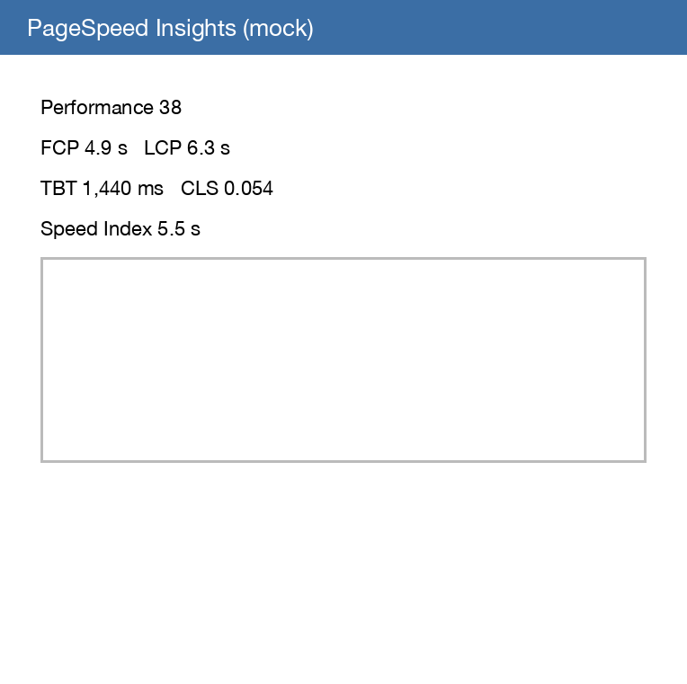
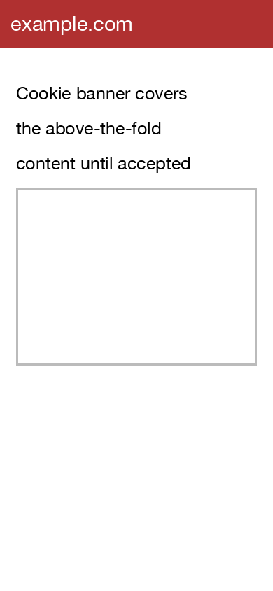
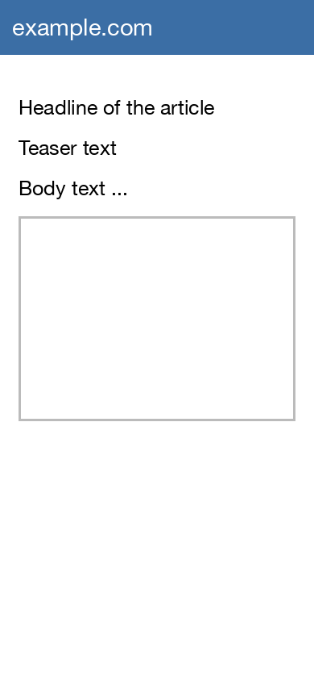
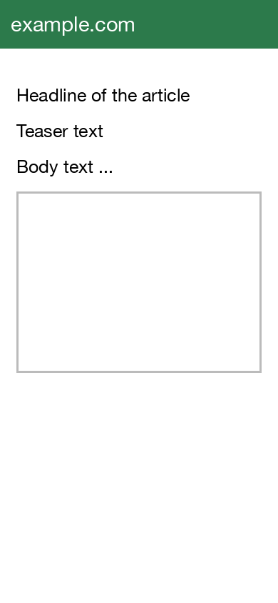
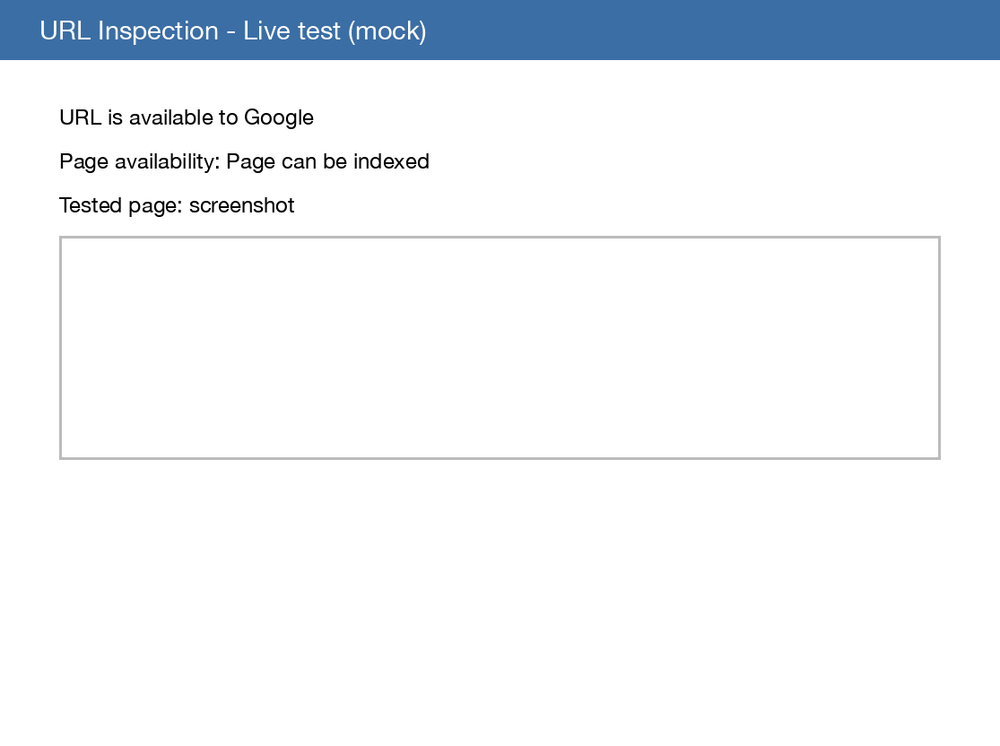
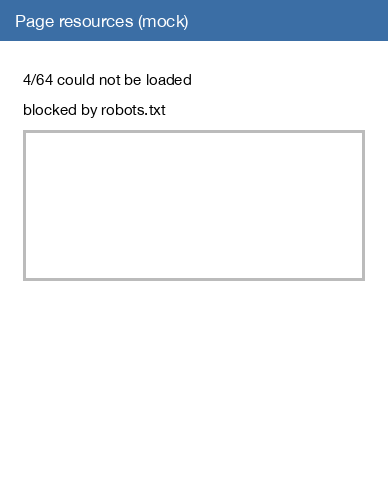

<!-- _class: title-left -->

# 3 SEO Tests

## [example.com](https://www.example.com/)

Footer: whitedeck / 11.09.2026

---

<!-- _class: title-bullets-left -->

# 3 SEO Tests to do 80% of technical onpage/onsite SEO right!

- **Page Speed Insights: minimum score of 80 (still orange) / preferrably 90 ([green]{#1db100}) + sensemaking screenshots** for desktop and mobile!
- **"JS turned off"** Test:
  - **Above fold and main content must be visible** on the site with JS turned off!
  - **Interlinking must work** with JS turned off! (Visible links must be links.)
- Google Search Console -> **Inspect URL -> Test Live URL -> View Tested Page -> Screenshot must show rendered page!** (Images below fold (non-visible) might get lazy loaded)

---

<!-- _class: section-left -->

# Detail Page

## [https://www.example.com/article/123](https://www.example.com/article/123)

---

<!-- _class: scope-shot -->

Scope: Detail Page ([https://www.example.com/article/123](https://www.example.com/article/123))

Tool: scope/tool-logo.png

# Google Page Speed Insights

Caption: [https://pagespeed.web.dev/analysis/https-www-example-com-article-123/abc123?form_factor=mobile](https://pagespeed.web.dev/analysis/https-www-example-com-article-123/abc123?form_factor=mobile)

---

<!-- _class: scope-compare -->

Scope: Detail Page ([https://www.example.com/article/123](https://www.example.com/article/123))

Tool: scope/tool-logo.png

# "JS turned off" Test

- **IS (not ok)**
- cookie banner initially displayed
- **SHOULD**
- display cookie banner after minimal user interaction

---

<!-- _class: scope-shot-notes -->

Scope: Detail Page ([https://www.example.com/article/123](https://www.example.com/article/123))

Tool: scope/tool-logo.png

# GSC Inspect URL

- **IS (not ok)**
- 4/64 resources could not be loaded
- **SHOULD**
- allow Googlebot to load all render-critical resources

Caption: [https://search.google.com/search-console/inspect?resource_id=sc-domain%3Aexample.com](https://search.google.com/search-console/inspect?resource_id=sc-domain%3Aexample.com)

---

<!-- _class: title-bullets -->

# A Keynote-geometry slide keeps its logo and gets real bold runs

- **Bold** stays bold in pptx and Keynote
- Links stay [blue and underlined](https://github.com/franzenzenhofer/whitedeck)
- One word can be [green]{#1db100}

Source: [whitedeck on GitHub](https://github.com/franzenzenhofer/whitedeck)
